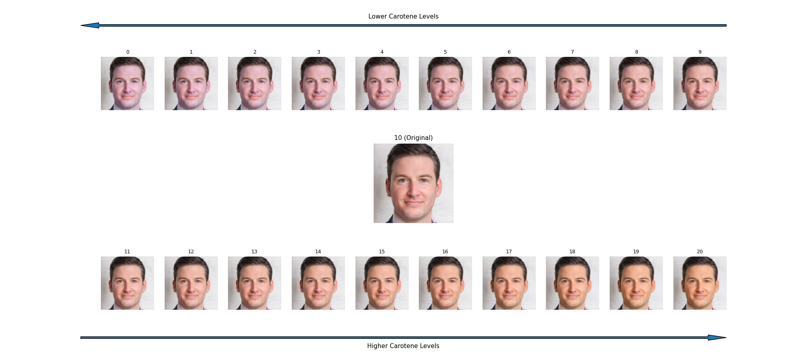

# Face Masker & Face Morphing: Research Stimulus Automation
A collection of AI-enhanced tools pertaining to an ongoing research on the impact
of different Carotene levels on the perception of attractiveness and health.

**The repo consists of:**
- **A Face Morphing tool**: A tool designed to provide latent-based morphs of individuals providing a means to anonymize participants in research studies. The tool utilizes a method called Pivotal Tuning Inversion to create near perfect recreations of participant's faces in W+ space; enabling non-linear interpolation between three particpants at a time.
- **A Face Masking tool**: Designed to apply progressively stronger tints to targeted areas of an image to simulate various shades along the CIELAB colour space in accordance with established methodologies. The tool utilizes a pretrained Facial Segmentation model to accurately mask skin areas while preserving natural features such as the eyes, lips, and hair.

## Results
### Face Morphing

### Face Masking

## Resources
- [NVIDIA's Stylegan2-ada-pytorch model](https://github.com/NVlabs/stylegan2-ada-pytorch)
- [Daniel Roich's Pivotal Tuning for Latent-based editing of Real Images](https://github.com/danielroich/PTI)
- [zllrunning's Facial Parsing Map implementation](https://github.com/zllrunning/face-parsing.PyTorch) extended from a [BiSeNet](https://github.com/CoinCheung/BiSeNet) backbone trained on the [CelebAMask-HQ dataset](https://github.com/switchablenorms/CelebAMask-HQ/)
- [Kaggle Notebook](https://www.kaggle.com/code/insertname123/ai-based-facial-morphing-gan2-pti-solution/)