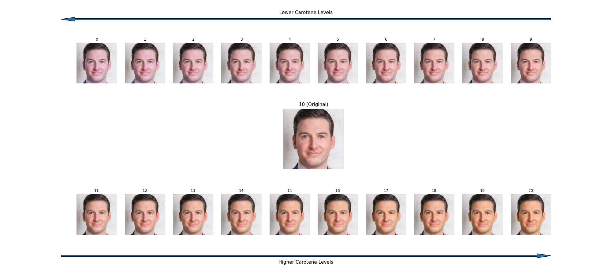

# Face Masker & Face Morphing: Research Stimulus Automation
A collection of AI-enhanced tools pertaining to an ongoing research on the impact
of different Carotene levels on the perception of attractiveness and health.

**The repo consists of:**
- **A Face Morphing tool**: A tool designed to provide latent-based morphs of individuals providing a means to anonymize participants in research studies. The tool utilizes a method called Pivotal Tuning Inversion to create near perfect recreations of participant's faces in W+ space; enabling non-linear interpolation between three particpants at a time.
- **A Face Masking tool**: Designed to apply progressively stronger tints to targeted areas of an image to simulate various shades along the CIELAB colour space in accordance with established methodologies. The tool utilizes a pretrained Facial Segmentation model to accurately mask skin areas while preserving natural features such as the eyes, lips, and hair.
## Installation and Usage
### Face Morphing
1. Create a copy of the kaggle notebook from [here](https://www.kaggle.com/code/insertname123/ai-based-facial-morphing-gan2-pti-solution)
2. Enable `Internet` under the Settings tab
3. Select `GPU P100` as the `GPU ACCELERATOR` option under the settings tab
4. Upload a zip file with a nested folders containing three images each. The names of these files are unimportant. An example of this is seen below:
```
Zip File
    > Morph_1_Folder
        > Person1.png
        > Person2.png
        > Person3.png
    > Morph_2_Folder
        > ...
```
5. Start PTI
6. The notebook WILL crash on the first run. Run the second code cell again and it will function correctly
7. Download the results.
### Face Masking
1. Git clone this repository
```
git clone https://github.com/RubinInsert/FaceMasker
```
2. OR, Download it manually from github
3. Move into the directory with the python code On Windows, this would be:
```
cd <Folder Directory>
```
5. Install the requirements
```
pip install -r requirements.txt
```
4. Ensure your folder structure has the following format. Not all folders are required to run the program. However, any morph images must be found at the end of a correct folder trail like `Input Folder > Male > Caucasian > 18-24 > M1.png` and must be named correctly as `M1.png`-`M10.png`:
```
Input Folder
    > Male
        > Caucasian
            > 18-24
            > 25-34
            > 35-44
            > 45-54
            > 55-64
            > 65 and over
        > African
            > ...
        > Asian
            > ...
    > Female
        > ...
```
5. Run the program using
```python
python3 main.py -input "Example_Folder_Input/" -output "Example_Folder_Output/" -color_tint 2.36,0,0 -thread_count 2
```
`input` dictates the input folder

`output` dictates the output folder

`color_tint` dictates what colour to apply to masked faces at each step. If more than one value is zero, the processing time will be longer.

`thread_count` dictates how much processing is allocated to the program. 2-4 is generally a reasonable value.
## Results
### Face Morphing

### Face Masking

## Resources
- [NVIDIA's Stylegan2-ada-pytorch model](https://github.com/NVlabs/stylegan2-ada-pytorch)
- [Daniel Roich's Pivotal Tuning for Latent-based editing of Real Images](https://github.com/danielroich/PTI)
- [zllrunning's Facial Parsing Map implementation](https://github.com/zllrunning/face-parsing.PyTorch) extended from a [BiSeNet](https://github.com/CoinCheung/BiSeNet) backbone trained on the [CelebAMask-HQ dataset](https://github.com/switchablenorms/CelebAMask-HQ/)
- [Kaggle Notebook](https://www.kaggle.com/code/insertname123/ai-based-facial-morphing-gan2-pti-solution/)
